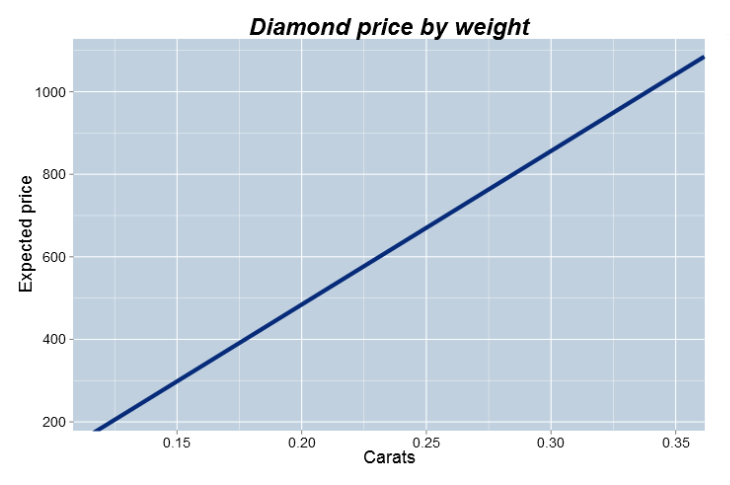
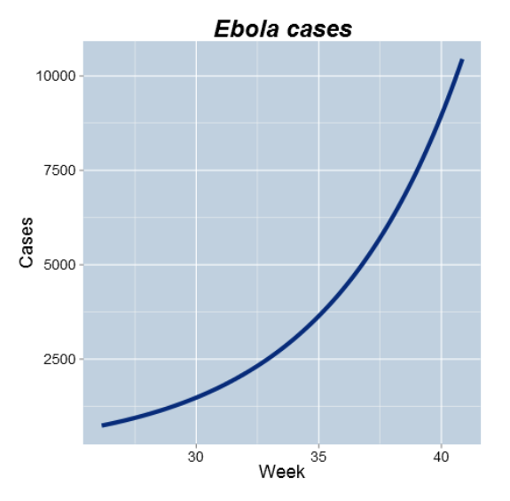
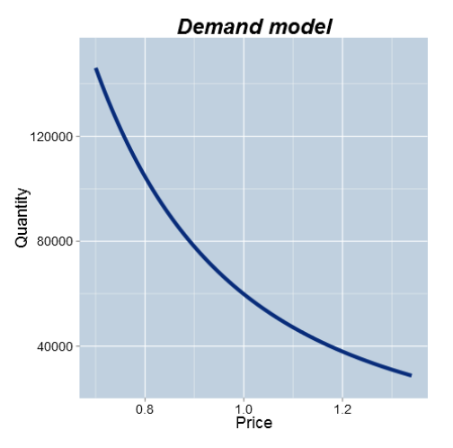

## Module 1

## Slide 1 - 3

Goals:
- Exporesure to the language of modeling
- Variety of quantitative business models and applications
- The process of modeling and how to critique models
- The value and limitations of quantitative models
- Foundation material for the other three courses in the Specialization

## Slide 4 - 10

### Content:
- Examples and uses of models
- Key steps in the modeling process
- Vocabulary for modeling
- Mathematical functions: Linear, Power, Exponential, Log

### What is a model?
- A model is a description of a business process
- It typically involves mathematical equations and/or random variables
- It is almost always a simplification of a more complex structure
- It typically relies upon a set of assumptions
- It is usually implemented in a computer program or using a spreadsheet

### Examples of Models:

- The price of a diamond as a function of its weight  
Model: Expected price = $-260 + 3721 Weight$  
  

- The spread of an epidemic over time  
Model: Cases = $6.69 e^{0.18 Weeks}$  
 

- The relationship between demand for, and price of, a product  
Model: $60,000 Price^{-2.5}$  
 

- The uptake of a new product in a market  
Model: $Prop = \frac{e^{2(Year - 2.5)}}{1 + e^{2(Year - 2.5)}}$  
 
