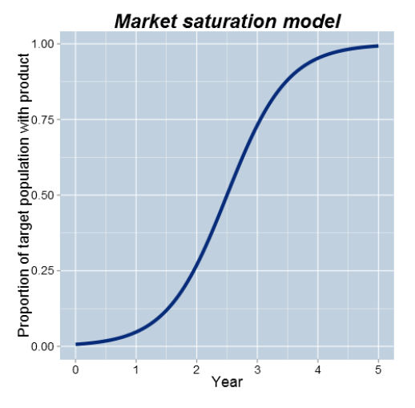
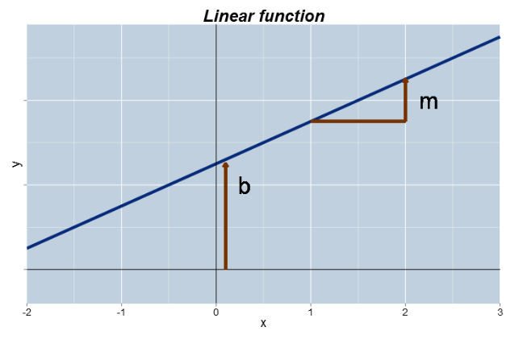
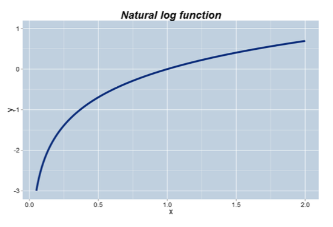
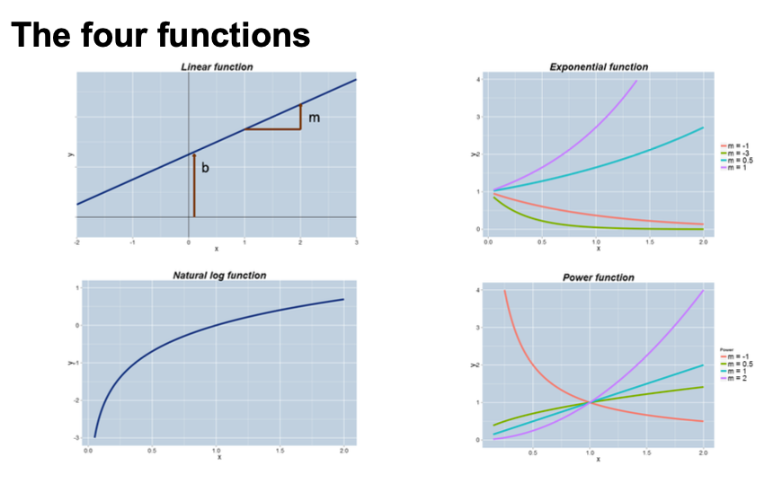

## Module 1

## 1.1 Course Introduction, Slide 1 - 3
Goals:
- Exporesure to the language of modeling
- Variety of quantitative business models and applications
- The process of modeling and how to critique models
- The value and limitations of quantitative models
- Foundation material for the other three courses in the Specialization

## 1.2 Definition and Uses of Models, Common Functions, Slide 4 - 10
### Content:
- Examples and uses of models
- Key steps in the modeling process
- Vocabulary for modeling
- Mathematical functions: Linear, Power, Exponential, Log
### What is a model?
- A model is a description of a business process
- It typically involves mathematical equations and/or random variables
- It is almost always a simplification of a more complex structure
- It typically relies upon a set of assumptions
- It is usually implemented in a computer program or using a spreadsheet
### Examples of Models:
- The price of a diamond as a function of its weight  
Model: Expected price = $-260 + 3721 Weight$  
  
- The spread of an epidemic over time  
Model: Cases = $6.69 e^{0.18 Weeks}$  
 
- The relationship between demand for, and price of, a product  
Model: $60,000 Price^{-2.5}$  
 
- The uptake of a new product in a market  
Model: $Prop = \frac{e^{2(Year - 2.5)}}{1 + e^{2(Year - 2.5)}}$  
 

## 1.3 How Models are Used in Practice, Slide 11 - 13
### How models are used in practice?
- Prediction: (calculating a single output)
    * What's the expected price of a diamond ring that weighs 0.2 carats?
- Forcasting: 
    * How many people are expected to be infected in 6 weeks?
    * Scheduling: Who is likely to turn up for their outpatient appointment?
- Optimization: 
    * What price maximizes profit?
- Ranking and Targeting: 
    * Given limit resources, which potential diamonds for sale should be targeted first for potential purchase?
- Exploring what-if scenarios:
    * If the growth rate of the epidemic increased to 20% each week, then how many infections would we expect in the next 10 weeks?
- Interpreting coefficients in model:
    * What do we learn from the coefficient -2.5 in the price/demand model?
- Assessing how sensitive the model is to key assumptions
    (Conduct a sensitivity analysis. Pretty evey model you create is going to rely on some assumptions. Sensitivity analysis is a process where we look to see how sensitive the outputs of the model are to some of those assumptions. If we find that the model that's particularly sensitive to an assumption, then that tells us that we need to think a little more carefully about that assumption. Maybe we will try and confirm that assumption is realistic or collect more info to try and tie that assumption down more precisely.)
### Benefits of Modeling:
- Identify gaps in current understanding
- Make assumptions explicit
- Have a well-defined description of the business process
- Create an institutional memory
- Used as a decision support tool
- Serendipitous insight generator

## 1.4 Key Steps in the Modeling Process, Slide 14 - 15
### Modeling Process Workflow:
    -------------------------------------------------------------------
    [A]     [Identify and define inputs and outputs] + [Define scope]
                                    |
                                    |
                                    |
    [B]                     [Formulate model]
                                    |
                                    |
                                    |
    [C]     [Perform sensitivity analysis] + [Validate model forcasts]
                                    |
                                    |
                                    |
    [D]                     [Fit for purpose]
                                    ?
                                    |
                                    Λ
                                   / \
                                  /   \
                              [No]     [Yes]
                             /              \
                            /                \
            (Back to step [A])                  [Implement model]
    -------------------------------------------------------------------

### What if the model doesn't always work?
- When the observed outcome differs greatly from the model's prediction (lousy predicting model), then there is the possibility of learning from this event if we can understand why the difference occurs
    * Then it turns out that that can be very, very informative, because if you can identify the reason why your model has not predicted or performed well, you've probably learned something new that you didn't know before. And that Is one of the great benefits of modeling, the actual ability to learn new things through the process by realizing that your current understanding isn't able to map to reality.
- Modeling is continuous and evolutionary process
- We identify the weaknesses and limitations and iterate the modeling process to overcome them

`All models are wrong but some are useful`

## 1.5 A Vocabulary for Modeling, Slide 15 - 20
### A modeling Lexicon
- Theory Driven vs. Data Driven
- Deterministic vs Probabilistic/Stochastic
- Discrete vs. Continuous Variables
- Static vs. Dynamic
### Data Driven vs. Theory Driven
Empirical (based on observations/experiments) <------> Theoretical
- Theory: given a set of assumptions and relationships, then what are the logical consequences?
    * Example: if we assume that markets are efficient then what should the price of a stock option be?
- Data: given a set of observations, how can we approximate the underlying process that generated them?
    * Example: I've separated out my profitable customers from the unprofitable ones. Now, what features are able to differentiate them?
### Deterministic vs. Probabilistic/Stochastic
- Deterministic: given a fixed set of inputs, the model always gives the same output.
    * Example: Invest $1000 at 4% annual compound interest for 2 years. After 2 years the initial $1000 will ALWAYS be worth $1081.60
- Probabilistic/Stochastic: Even with identical inputs, the model output can vary from instance to instance.
    * Example: A person spends $1000 on lottery tickets. After draawing how much they worth depends on a random variable, whether or not they won the lottery.
### Discrete vs. Continuous Variables
- Discrete: characterized by jumps and distinct values.
- Continuous: a smooth process with an infinite number of potential values in any fixed interval.
### Static vs. Dynamic
- Statis: the model captures a single snapshot of the business process.
    * Given a website's installed software base, what are the chances that it is compromised today?
- Dynamic: the evolution of the process itself is of interest. The model describes the movement from state to state.
    * Given a person's participation in a job training program, how long will it take until he/she finds a job and then, if they find one, for how long wil they keep it?

## 1.6 Mathematical Functions, Slide 21 - 32
### Key mathematical functions:
- Four math functions provide the foundations for quantitative modeling:
    - Linear
    - Power
    - Exponential
    - Log
### The Linear Function

Function: $ y = mx + b $
- x is the input, y is the output
- b is the intercept
- m is the slope
- Essential characteristic: the slope is constant
    - A one-unit change in x corresponds to an m-unit change in y

We have to ask if the assumption is linear, for example, salary and times might not be the best for linear model, salary goes up in the beginning and tend to slow down and level up later on. Not a linear model.

### The Power Function

Function: $ y = x^m $
- x is the base
- m is the exponent
- Essential characteristic:
    - A one percent (proportionate) change in x corresponds to an approximate m percent (proportionate) change in y
    => If x changes by 1 % (not unit) then y is changed by approximately m %
- Facts:
    - $ x^m x^n = x^{m+n} $
    - $ x^{-m} = 1/x^m $

Reciprocal of a number: reciprocal of x is denoted as $1/x$

### The Exponential Function

Function: $ y = e^{mx} $
- e is the mathematical constant: 2.71828......
- Notice that as compared to a power function, x is in the exponent of the function and not the base.
- Essential characteristic:
    - The rate of change of y is proportional to y itself.
- Intepretation of m for small values of m (say -0.2 <= m <= 0.2)
    - For very one-unit change in x, there is an approximate 100m% (proportionate) change in y
    - Example: if m=0.05, then one-unit increase in x is associated with an approximate 100*0.05% = 5% increase in y

- Because $e^0 = 1$, $y = e^{mx} = e^{m0} = 1$, power function always start at y=1

### The Log Function

 
`Proportionate change in x is associated with constant change in y`

- The log function is very usefull for modeling processes that exhibit diminishing returns to scale.
- These are processes that increase but at a decreasing rate.
- Essential characteristic:
    - A constant proportionate change in x is associated with the same absolute change in y.

Function: $ y = log_b(x) $
- b is called the base of the algorithm.
- THe most frequently sed base is the number $e$ and the logarithm is called the "natural log"
- The log undoes (in the inverse of) the exponential function:
    - $ log_e{e}^x = x $
    - $ e^{log_e{x}} = x $
- $ log(xy) = log(x) + log(y) $

## 1.7 Summary, Slide 33 - 36

- Uses for models
- Steps in the modeling process
    - It's an iterative process and model validation is key.
- Discussed various types of models, discrete vs. continuous, etc.
- Reviewed essential mathematical functipns that form the foundation of quantitative models.

