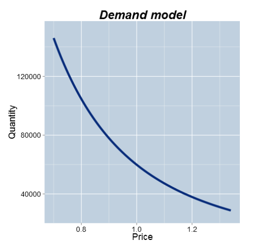

# COURSE 1
------------------------------------------------------------
## Module 1: Introduction and core modeling math
------------------------------------------------------------
### 1.1 Course Introduction, Slide 1 - 3
#### Goals:
- Exporesure to the language of modeling
- Variety of quantitative business models and applications
- The process of modeling and how to critique models
- The value and limitations of quantitative models
- Foundation material for the other three courses in the Specialization
------------------------------------------------------------
### 1.2 Definition and Uses of Models, Common Functions, Slide 4 - 10
#### Content:
- Examples and uses of models
- Key steps in the modeling process
- Vocabulary for modeling
- Mathematical functions: Linear, Power, Exponential, Log
#### What is a model?
- A model is a description of a business process
- It typically involves mathematical equations and/or random variables
- It is almost always a simplification of a more complex structure
- It typically relies upon a set of assumptions
- It is usually implemented in a computer program or using a spreadsheet
#### Examples of Models:
- The price of a diamond as a function of its weight  
    - Model: Expected price = $-260 + 3721 Weight$  
    -   
- The spread of an epidemic over time  
    - Model: Cases = $6.69 e^{0.18 Weeks}$  
    -  
- The relationship between demand for, and price of, a product  
    - Model: $60,000 Price^{-2.5}$  
    -  
- The uptake of a new product in a market  
    - Model: $Prop = \frac{e^{2(Year - 2.5)}}{1 + e^{2(Year - 2.5)}}$  
    -  
------------------------------------------------------------
### 1.3 How Models are Used in Practice, Slide 11 - 13
#### How models are used in practice?
- Prediction: (calculating a single output)
    * What's the expected price of a diamond ring that weighs 0.2 carats?
- Forcasting: 
    * How many people are expected to be infected in 6 weeks?
    * Scheduling: Who is likely to turn up for their outpatient appointment?
- Optimization: 
    * What price maximizes profit?
- Ranking and Targeting: 
    * Given limit resources, which potential diamonds for sale should be targeted first for potential purchase?
- Exploring what-if scenarios:
    * If the growth rate of the epidemic increased to 20% each week, then how many infections would we expect in the next 10 weeks?
- Interpreting coefficients in model:
    * What do we learn from the coefficient -2.5 in the price/demand model?
- Assessing how sensitive the model is to key assumptions
    (Conduct a sensitivity analysis. Pretty evey model you create is going to rely on some assumptions. Sensitivity analysis is a process where we look to see how sensitive the outputs of the model are to some of those assumptions. If we find that the model that's particularly sensitive to an assumption, then that tells us that we need to think a little more carefully about that assumption. Maybe we will try and confirm that assumption is realistic or collect more info to try and tie that assumption down more precisely.)
#### Benefits of Modeling:
- Identify gaps in current understanding
- Make assumptions explicit
- Have a well-defined description of the business process
- Create an institutional memory
- Used as a decision support tool
- Serendipitous insight generator
------------------------------------------------------------
### 1.4 Key Steps in the Modeling Process, Slide 14 - 15
#### Modeling Process Workflow:
    -------------------------------------------------------------------
    [A]     [Identify and define inputs and outputs] + [Define scope]
                                    |
                                    |
                                    |
    [B]                     [Formulate model]
                                    |
                                    |
                                    |
    [C]     [Perform sensitivity analysis] + [Validate model forcasts]
                                    |
                                    |
                                    |
    [D]                     [Fit for purpose]
                                    ?
                                    |
                                    Λ
                                   / \
                                  /   \
                              [No]     [Yes]
                             /              \
                            /                \
            (Back to step [A])                  [Implement model]
    -------------------------------------------------------------------

#### What if the model doesn't always work?
- When the observed outcome differs greatly from the model's prediction (lousy predicting model), then there is the possibility of learning from this event if we can understand why the difference occurs
    * Then it turns out that that can be very, very informative, because if you can identify the reason why your model has not predicted or performed well, you've probably learned something new that you didn't know before. And that Is one of the great benefits of modeling, the actual ability to learn new things through the process by realizing that your current understanding isn't able to map to reality.
- Modeling is continuous and evolutionary process
- We identify the weaknesses and limitations and iterate the modeling process to overcome them  
- `All models are wrong but some are useful`
------------------------------------------------------------
### 1.5 A Vocabulary for Modeling, Slide 15 - 20
#### A modeling Lexicon
- Theory Driven vs. Data Driven
- Deterministic vs Probabilistic/Stochastic
- Discrete vs. Continuous Variables
- Static vs. Dynamic
#### Data Driven vs. Theory Driven
Empirical (based on observations/experiments) <------> Theoretical
- Theory: given a set of assumptions and relationships, then what are the logical consequences?
    * Example: if we assume that markets are efficient then what should the price of a stock option be?
- Data: given a set of observations, how can we approximate the underlying process that generated them?
    * Example: I've separated out my profitable customers from the unprofitable ones. Now, what features are able to differentiate them?
#### Deterministic vs. Probabilistic/Stochastic
- Deterministic: given a fixed set of inputs, the model always gives the same output.
    * Example: Invest $1000 at 4% annual compound interest for 2 years. After 2 years the initial $1000 will ALWAYS be worth $1081.60
- Probabilistic/Stochastic: Even with identical inputs, the model output can vary from instance to instance.
    * Example: A person spends $1000 on lottery tickets. After draawing how much they worth depends on a random variable, whether or not they won the lottery.
#### Discrete vs. Continuous Variables
- Discrete: characterized by jumps and distinct values.
- Continuous: a smooth process with an infinite number of potential values in any fixed interval.
#### Static vs. Dynamic
- Statis: the model captures a single snapshot of the business process.
    * Given a website's installed software base, what are the chances that it is compromised today?
- Dynamic: the evolution of the process itself is of interest. The model describes the movement from state to state.
    * Given a person's participation in a job training program, how long will it take until he/she finds a job and then, if they find one, for how long wil they keep it?
------------------------------------------------------------
### 1.6 Mathematical Functions, Slide 21 - 32
#### Key mathematical functions:
- Four math functions provide the foundations for quantitative modeling:
    - Linear
    - Power
    - Exponential
    - Log
#### The Linear Function
  
Function: $ y = mx + b $
- x is the input, y is the output
- b is the intercept
- m is the slope
- Essential characteristic: the slope is constant
    - A one-unit change in x corresponds to an m-unit change in y
- We have to ask if the assumption is linear, for example, salary and times might not be the best for linear model, salary goes up in the beginning and tend to slow down and level up later on. Not a linear model.
#### The Power Function
  
Function: $ y = x^m $
- x is the base
- m is the exponent
- Essential characteristic:
    - A one percent (proportionate) change in x corresponds to an approximate m percent (proportionate) change in y
    => If x changes by 1 % (not unit) then y is changed by approximately m %
- Facts:
    - $ x^m x^n = x^{m+n} $
    - $ x^{-m} = \frac{1}{x^m} $
- Reciprocal of a number: reciprocal of x is denoted as $1/x$
#### The Exponential Function
  
Function: $ y = e^{mx} $
- e is the mathematical constant: 2.71828......
- Notice that as compared to a power function, x is in the exponent of the function and not the base.
- Essential characteristic:
    - The rate of change of y is proportional to y itself.
- Intepretation of m for small values of m (say -0.2 <= m <= 0.2)
    - For very one-unit change in x, there is an approximate 100m% (proportionate) change in y
    - Example: if m=0.05, then one-unit increase in x is associated with an approximate 100*0.05% = 5% increase in y
- Because $e^0 = 1$, $y = e^{mx} = e^{m0} = 1$, power function always start at y=1
#### The Log Function
- Log Functions  
      
      
    `Proportionate change in x is associated with constant change in y`
    - The log function is very usefull for modeling processes that exhibit diminishing returns to scale.
    - These are processes that increase but at a decreasing rate.
    - Essential characteristic:
        - A constant proportionate change in x is associated with the same absolute change in y.
    - Function: $ y = log_b(x) $
    - b is called the base of the algorithm.
    - THe most frequently sed base is the number $e$ and the logarithm is called the "natural log"
    - The log undoes (in the inverse of) the exponential function:
        - $ log_e{e}^x = x $
        - $ e^{log_e{x}} = x $
    - $ log(xy) = log(x) + log(y) $
------------------------------------------------------------
### 1.7 Summary, Slide 33 - 36
- Summary
      
    - Uses for models
    - Steps in the modeling process
        - It's an iterative process and model validation is key.
    - Discussed various types of models, discrete vs. continuous, etc.
    - Reviewed essential mathematical functipns that form the foundation of quantitative models.
------------------------------------------------------------

------------------------------------------------------------
## Module 2: Deterministic / Linear models and optimization
- Linear models:
- Growth and decay in discrete time
- Growth and decay in continuous time
- Classical optimization
------------------------------------------------------------
### 2.1 Intro to Linear Models and Optimixzation, slide 1 - 10
Reminder: The model is deterministic when the output stays the same given the input every time.
#### Deterministic Models:
- There are no random/uncertain components (inputs and/or outputs) in these models.
- If the inputs to the model are the same then the inputs willl always be the same.
- The downside of deterministic models: it is hard to assess uncertainty in the outputs.
#### Linear Models:
- Recall the formula definition of a straight line: `y = mx+b`
- Characterization of a line: the slope is constant.
- THe change in y for a one-unit change in x is the same, regardless of the value of x
- In practice you should ask if the constant slope assertion is realistic.
If it is not realisti, then a straight line model is probably not the way to go.
#### A Linear Cost Function:
- Call the number of units produced q, and the total cost of producing q units C
- Define: `C = 100 + 30q`
- Calculate some illustrative values:
    |   q   |   C   | calculation |
    |:-----:|:-----:|:-----------:|
    | 0     | 100   | 100 + 30*0  |
    | 10    | 400   | 100 + 30*10 |
    | 20    | 700   | 100 + 30*20 |
  
- Interpretation:
    - The two coefficients in the line are the intercept and the slope: b and m in general, 100 and 30 in this particulate instance.
    - b: the total cost of producing 0 units
        - A better interpretation: that part of total cost that doesn't depend on the quantity produced: the fixed cost.
    - m: the slop of the line
        - The change in total cost for an incremental unit of production: the variable cost.
#### Example with a "time-to-produce" function:
+ It takes 2 hrs to set up a prodution run, and each incremental unit produced always takes an additional 15 minutes (0.25 hrs)
+ Call T the time to produce q units, then: `T = 2 + 0.25q`
+ Interpretation:
    + b: the setup time (2hrs)
    + m: the work rate(15min per additional item)
 
#### Linear Programming:
- One of the key uses of linear models is in Linear Programming (LP), which is a technique to solve certain optimization problems.
- These models incorporate constraints to make them more realistic.
- Linear programming problems can be solver with add-ins for common spreadsheet programs.        
------------------------------------------------------------
### 2.2 Growth in Discrete Time, slide 11 - 14
#### Growth in discrete time
- Growth is a fundamental business concept:
    + The number of customers at time t
    + The revenue in quarter q
    + The value of an investment at some time t in the future
- Sometimes a linear model may be appropriate for a growth process.
- But an alternative to a linear (additive) growth model is a proportionate one.
- Proportionate growth: a constant percent increase (decrease) from one period to the next.
#### Simple Interest
- Start off with $100 (principal) and at the end of every year earn 10% simple interest on the initial $100.
- Simple interest means that interest is only earned on the principal investment.
    | Year  | 0      | 1      | 2      | 3      | 4      | 10     |
    |-------|--------|--------|--------|--------|--------|--------|
    | Value | 100.00 | 110.00 | 120.00 | 130.00 | 140.00 | 200.00 |
- Every year the investment grows by the same amount ($10)
#### Compound interest
- Starte off with $100 (principal) and at the end of every year earn 10% compound interest on the initial $100
- Compound interest means that the interest itself earns interest in subsequent years.
    | Year  | 0      | 1      | 2      | 3      | 4      | 10     |
    |-------|--------|--------|--------|--------|--------|--------|
    | Value | 100.00 | 110.00 | 121.00 | 133.10 | 146.41 | 259.37 |
- Notice that the growth is no longer the same absolute amount each year, but it is the same proportionate (relative) amount (10%).
#### The growth of the two investments
-  
------------------------------------------------------------
### 2.3 Constant Proportionate Growth, slide 15 - 20
#### Constant proportionate growth
- Denote the initial amount at $P_0$
- Denote the constant proportionate growth factor by $θ$ (for example 10% growth means multiply by 1.1 at the end of each time period)
- The growth progression is:
    | Time          | 0     | 1        | 2          | 3          | t          |
    |---------------|-------|----------|------------|------------|------------|
    | Amount, $P_t$ | $P_0$ | $P_0{θ}$ | $P_0{θ^2}$ | $P_0{θ^3}$ | $P_0{θ^t}$ |
- $θ > 1$ means the process is growing
- $θ < 1$ means the process is declining/decaying
- This type of progression is called a geometric progression or geometric series
#### Example
- An Indian Ocean nation caught 200,000 tonnes of fish this year
- The catch is projected to fall by a constant 5% factor each year for the next 10 years.
- How many fish are predicted to be caught 5 years from now?
- Including this year, what is the total expected catch over the next 5 years?
#### The constant multiplier
- For the catch to fall by 5% each year, means that the multiplier is $θ = 0.95$
- In general, if the process is changing by R% in each time period, then the multiplier is: $θ = 1 + \frac{R}{100}$
- Example:
    - If the increase if 5% then $θ = 1.05$
    - If the decrease if 5% then $θ = 0.95$
#### Working out the fish catch
- With $P_0$ = 200,000 and $θ = 0.95$, in 5 years the catch will be $ 200,000 * 0.95^5 = 154,756 $
- Over the next 5 years:
    | Year  | Catch          |
    |-------|----------------|
    | 0     |   200,000      |
    | 1     |   190,000      |
    | 2     |   180,500      |
    | 3     |   171,475      |
    | 4     |   162,901.25   |
    | 5     |   154,756.1875 |
    | Total | 1,059,632.4375 |
- We get the total catch summing over the years in question
#### Graphing the annual fish catch
-   
#### The sum of the geometric series
- If we denote the sum up to time t as $ S_t $, then $ S_t = P_0 \frac{1-θ^{t+1}}{1-θ} $
- With the fisheries example:
    - $ S_5 = 200,000 * \frac{1-0.95^{5+1}}{1-0.95} = 1,059,632.4375 $
- The mathematical formulation of the model can sometimes provide more direct answers than a spreadsheet.
------------------------------------------------------------
### 2.4 Present and Future Value, slide 21 - 28
#### Present and future value
- If there is no inflation and the prevailing interest rate is 4%, then which of the following options would you prefer?
    - $1000 today or $1500 in ten years?
- Either look to see how much $1000 will be worth in ten years, or calculate how much you would have to invest today to get $1500 ten years from now.
- The latter approach relies on the concept of present value - the expected current value of  an income stream. 
#### The present value calculation
- We know that $ P_t = P_0θ^t $ and making $ P_0 $ the subject of the formula means that $ P_0 = P_tθ^{-t} $
- Therefore $1500 in ten years time in 4% interest rate environment is worth:
    - $ P_0 = P_tθ^{-t} = 1500*(1+0.04)^{-10} = 1,013.346253 $
- $1013.35 is more than $1000, so you should prefer the second investment of $1500 received in ten years.
- This straightforward proportionate increase model allows for a simple discounting formula.
#### Uses of present value
- A primary use is in discounting investments to the present time.
- An `annuity` is a schedule of fixed payments over a specified and finite time period.
- The present value of an annuity is the sum of the present values of each separate payment.
- Present value is also used in lifetime customer value calculations.
#### Continuous compounding
- The compounding period for an investment can be yearly, monthly, weekly, daily, etc.
- As the compounding period gets shorter and shorter, in the limit, the process is said to be continuously compounded.
- If a principal amount $P_0$ is continuously compounded at a nominal annual interest rate of R%, then at year t:
    - $ P_t = P_0e^{rt} $ where $ r = \frac{R}{100} $
- In this model, t can take on any value in an interval, whereas in the discrete model t could only take on distinct values.
- $1000 continuously compounded at a nominal anual interest rate of 4% is worth after one year:
    - $ 1000e^{0.04} $
- Note that this is a little more than if the 4% was earned at the very end of the time period, in which case you would have exactly $1040 at the end of the year.
#### Modeling an epidemic
- The model $P_t = P_0e^{rt}$ doesn't just describe money growing.
- This model is called exponential growth or decay depending on whether r is positive or negative respectively.
- A continuous time model for the initial stages of an epidemic states that the number of cases at week t is $15e^{0.15t}$
- Halfway through week 7, how many cases do you expect?
#### Graphing the epidemic
-   
#### Calculating the expected number of cases
- Calculation:
    - Halfway through week 7 = 7.5 => $ t=7.5 $
    - Given $ 15e^{0.15t} $ and we know that $ P_0e^{rt} $. Therefore: $ P_0=15 $ and $ r=0.15 $
    - $ 15e^{0.15*7.5} = 15e^{1.125} = 46.2 ≈ 46 cases $
- Interpretation of the 0.15 coefficient:
    - There are approximate 15% weekly growth rate in cases.
- Continuous models allow calculation at any value of t, not just a set of discrete values.
-   
------------------------------------------------------------
### 2.5 Optimization, slide 29 - 33
#### Using a model for optimization
- A common modeling obective is to perform a subsequent optimization.
- The objective of the optimization is to find the value of an input that maximizes/minimizes an output.
- Example: find the price at which profit is maximized.
#### Demand model
- Consider the demand model:
    - $ Quantity = 60,000 Price^{-2.5} $ = q
- If the price of production is constant at c=2 for each unit, then at what price is profit maximized?
- Profit = Revenue - Cost
- Revenue = Price * Quantity = p * q
- $ Profit = p*q - c*q = q(p-c) = 60,000p^{-2.5}(p-2) $
- Goal: choose p to maximize this equation.
#### Brute force approach
- Choose different values of p and plot profit.
-   
#### Calculus approach
- Profit is maximized when derivative (rate of change) of profit
- Through calculus one obtains the optimal value of price as $ P_opt = \frac{c*b}{1+b} $, where c is the production cost and b is the exponent in the power function.
- In this example c=2 and b=-2.5 This gives $ P_opt = \frac{2*-2.5}{(1-2.5)} ≈ 3.33 $
- The value (-b) is known as `the price elasticity of demand`
#### Visualizing the calculus solution
- The area of the gray shaded box is the profit and the objective is t find the value of price for which the area of the box is largest.
- <video width="900" height="450" controls>
    <source src="screenshots/calculusApproach.mov" type="video/mp4">
  </video>
------------------------------------------------------------
### 2.6 Summary, slide 34 - 36
#### Summary
- Linear models
- Growth and decay in discrete time: geometric series models
- Growth and decay in continuous time: exponential growth models
- Present and future value
- Use classical optimization (calculus) to gain additional value from the model.
------------------------------------------------------------

------------------------------------------------------------
## Module 3: Probabilistic Models
- Contents:
    - What are probabilistic models?
    - Random variables and probability distritutions - the building blocks
    - Examples of probabilistic models
    - Summaries of probability distritutions: means, variances, and standard deviation
    - Special random variables: Bernoulli, Binomial, and Normal
    - The Empirical Rule
------------------------------------------------------------
### 3.1 Intro to Probabilistic Models, slide 1 - 6
------------------------------------------------------------
### 3.2 Examples of Probabilistic Models, slide 7
------------------------------------------------------------
### 3.3 Regression Models, slide 8 - 9
------------------------------------------------------------
### 3.4 Probability Trees, slide 10
------------------------------------------------------------
### 3.5 Monte Carlo Simulation, slide 11 - 12
------------------------------------------------------------
### 3.6 Markov Chain Models, slide 13 - 14
------------------------------------------------------------
### 3.7 Building Blocks of Probability Models, slide 15 - 19
------------------------------------------------------------
### 3.8 The Bernoulli Distribution, slide 20 - 21
------------------------------------------------------------
### 3.9 The Binomial Distribution, slide 22 - 26
------------------------------------------------------------
### 3.10 The Normal Distribution, slide 27 - 29
------------------------------------------------------------
### 3.11 The Empirical Rule, slide 30 - 33
------------------------------------------------------------
### 3.12 Summary, slide 34 - 36
------------------------------------------------------------